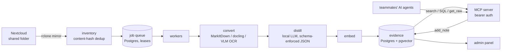

# OpenKnowledge

A self-hosted, AI-queryable knowledge base for a working team. It turns a
shared Nextcloud folder full of messy multilingual documents (contracts,
reports, papers, letters — Kazakh, Russian, English) into a structured
knowledge layer that teammates' AI agents query over
[MCP](https://modelcontextprotocol.io) — and write back into.

## The problem

A team's shared folder accumulates hundreds of files with chaotic naming
("Документ Microsoft Word.docx"), scanned PDFs, and four copies of the same
contract. Finding "what did we agree with vendor X" or "who worked on
project Y" means asking around. Every teammate now has an AI assistant that
could answer such questions — if it could see the documents. OpenKnowledge
is that bridge, with one hard constraint: **no document content ever leaves
the team's own hardware** — conversion, OCR, distillation and embeddings
all run on self-hosted GPUs (vLLM).

## Who uses it

Teammates connect their own AI agent (Claude Code or any MCP client) with a
personal bearer token — no VPN, no accounts. Agents search by meaning, run
SQL over extracted metadata, fetch verbatim originals, and save distilled
notes back after significant work (human-approved, attributed via the
token). An operator runs the pipeline from a web admin panel.

## Architecture



- **Pipeline**: content-hashed inventory → crash-safe Postgres job queue
  (lease-based claiming, idempotent upserts) → format conversion (docling
  recovers PDF heading structure; scans are OCR'd page-by-page by a
  vision-capable LLM, results cached) → per-chunk distillation with guided
  JSON decoding → per-document "passport" (doc_type/title/year/authors,
  each with a `basis` provenance field) → hybrid retrieval (pgvector HNSW +
  full-text, RRF, per-document cap).
- **MCP server** (9 tools, bearer tokens stored hashed): `search`,
  `search_docs`, `search_meetings`, `query_evidence` (guard-railed
  read-only SQL for enumeration and counting), `get_raw`, `recent`,
  `status` (live pipeline state), `list_projects`, `add_note` (the write
  channel — the KB is two-way).
- **Admin panel** (Starlette): scrypt auth, HMAC-signed sessions, CSRF,
  login rate limiting; live dashboard, folder drill-down document browser
  with chunk/raw views, job requeue/park, token management, soft pause with
  graceful worker restart.

## Privacy model

Documents contain contracts and personal data, so the design constraint
from day one: all inference is local (self-hosted vLLM endpoints), the
database and raw store live on the team's own server, public access goes
through a reverse proxy with per-person revocable tokens, and the MCP
`add_note` guidance explicitly forbids saving secrets. Notes are
append-only: corrections are new notes, history is never rewritten.

## Current scale

Snapshot, August 2026: ~1,150 files mirrored; 860 documents / ~3,000
chunks indexed across three languages; runs unattended on two GPU nodes.

## Layout

- `src/okb/` — ingest pipeline (inventory → normalize → distill → embed →
  upsert), hybrid retrieval (RRF + freshness decay), MCP server, admin panel.
- `migrations/` — plain SQL, applied in filename order by `okb init-db`.
- `deploy/systemd/` — user units; batch work runs as transient units so an
  admin restart never kills a running job.
- Inference: vLLM endpoints on a GPU inference node (generation + vision
  OCR on one model, embeddings truncated to 1536 dims — pgvector HNSW caps
  at 2000, the model is matryoshka-trained).

## Quick start (on the controller node)

```bash
uv sync
cp .env.example .env            # point endpoints/DSN at your own hosts
docker compose up -d            # Postgres 16 + pgvector on 127.0.0.1:15432
uv run okb init-db
uv run okb ingest ~/kb-data/inbox
uv run okb worker --once
uv run okb token-create <name>  # prints the bearer token once
uv run okb mcp                  # streamable HTTP on :17000/mcp
```

Client hookup:

```bash
claude mcp add openknowledge --transport http http://<kb-host>:17000/mcp \
  --header "Authorization: Bearer kb_live_..."
```

Design docs and as-built notes: [docs/](docs/).
